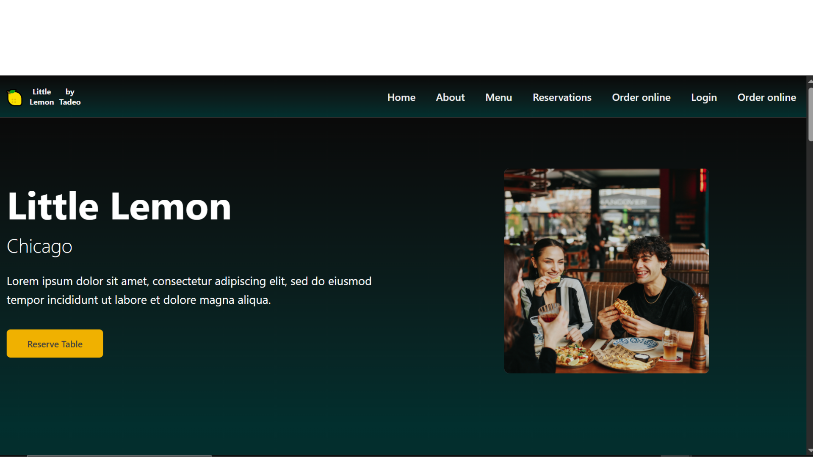

---

```markdown
# 🍋 Little Lemon Restaurant Website

This is the final project for the **Meta Front-End Developer Professional Certificate** on Coursera. It features a modern, responsive web interface for a fictional restaurant called **Little Lemon**.

---

## 🚀 Tech Stack

- **Framework:** React + Vite
- **Language:** TypeScript
- **Styling:** TailwindCSS
- **UI Libraries:**
  - Radix UI
  - `@radix-ui/react-datepicker` (Date Picker)
  - `lucide-react` (Icons)
  - `recharts` (Charts and Data Visualization)
- **Code Quality:**
  - ESLint (TypeScript & React specific rules)
- **CI/CD & Deployment:**
  - GitHub Actions
  - GitHub Pages

---

## 🎨 Features

- ⚡ Fast and lightweight with Vite
- 🌓 Dark and light mode
- 📅 Interactive date picker
- 📊 Dynamic data charts
- 🔧 Component-based architecture
- 🧩 Accessible UI with Radix
- 📱 Fully responsive (mobile-friendly)
- 🚀 Automatic deployment with GitHub Actions

---

## 📂 Project Structure

```

├── public/
│   └── screenshot.png         # Project preview image
├── src/
│   ├── components/            # UI components
│   ├── pages/                 # Page views
│   ├── assets/                # Static assets
│   ├── App.tsx                # Root component
│   └── main.tsx               # Entry point
├── tailwind.config.ts
├── tsconfig.json
├── vite.config.ts
└── package.json

````

---

## 🛠️ Getting Started

Follow these steps to run the project locally:

### 1. Clone the repository

```bash
git clone https://github.com/your-username/little-lemon.git
cd little-lemon
````

### 2. Install dependencies

Make sure you have [Node.js](https://nodejs.org/) installed (preferably v18+).

```bash
npm install
```

### 3. Start the development server

```bash
npm run dev
```

The project will run locally at:

```
http://localhost:5173
```

---

## ✅ Available Scripts

| Script            | Description                      |
| ----------------- | -------------------------------- |
| `npm run dev`     | Start local dev server           |
| `npm run build`   | Build the project for production |
| `npm run preview` | Preview the production build     |
| `npm run lint`    | Run ESLint to check code quality |

---

## 🧪 ESLint Setup

This project includes advanced linting configurations with support for:

* TypeScript
* React
* JSX/TSX files
* React-specific DOM rules

You can run the linter with:

```bash
npm run lint
```

If needed, you can expand ESLint with:

```bash
npm install eslint-plugin-react-x eslint-plugin-react-dom -D
```

---

## 🔄 CI/CD with GitHub Actions

Every time you push to the `main` branch, GitHub Actions will automatically:

1. Install dependencies
2. Build the project
3. Deploy the site to GitHub Pages


---

## 🌐 Live Demo

👉 [View Live Site](https://tadeooa.github.io/little-lemon/)

> Replace `your-username` with your actual GitHub username if needed.

---

## 📷 Preview



---

## 📚 Credits

This project was created as part of the **Meta Front-End Developer Certificate** 

Design and development by **Your Name**.

---

## 📄 License

MIT License © 2025 Juan Tadeo

```

---


```

